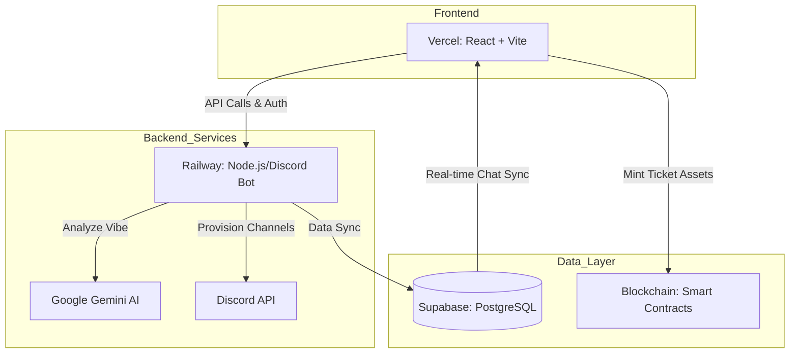
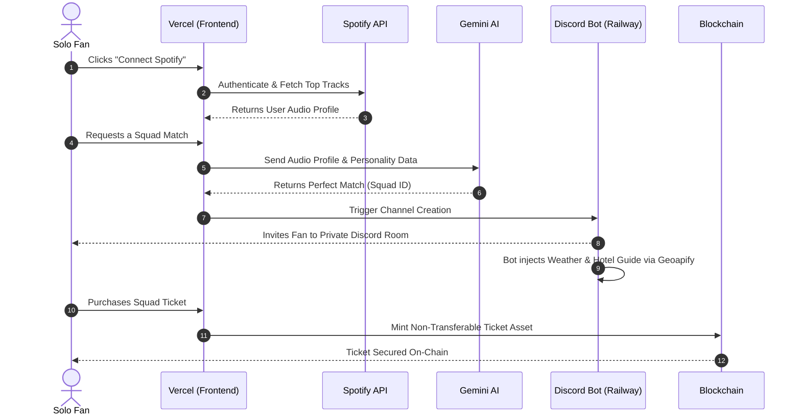

# 🎫 TiX-One: Next-Gen Concert Ticketing & Squad Matching

<div align="center">

<div align="center">
  
</div>

**Bridging the gap between solo fans and epic concert experiences while nuking the scalper market.**

[](https://reactjs.org/)
[](https://vitejs.dev/)
[](https://tailwindcss.com/)
[](https://supabase.com/)
[](https://deepmind.google/technologies/gemini/)
[](https://railway.app/)

[🚀 Live Demo](https://ti-x-one-deploy.vercel.app) • [⚙️ Backend API](https://tix-one-deploy-production.up.railway.app)

</div>

---

## 🎯 The Mission: Reclaiming the Concert Experience

Concert-going today is broken. **TiX-One** is built to solve the two biggest hurdles facing real fans:

### 🤝 1. The Solo-Goer Dilemma
> **Problem:** Millions of fans miss out on concerts because they have no one to go with, or they feel isolated in a crowd of thousands.


* **The AI Fix:** We utilize **Google Gemini** to analyze musical "vibes" and personality traits, automatically pairing solo fans into high-synergy **Concert Squads**.
* **Social Synergy:** Matches are based on shared Spotify listening history and "concert energy" preferences.
* **Safe Spaces:** Squads are small (4-5 people) to ensure everyone can connect effectively without feeling overwhelmed.

<br clear="right"/>

### 🛡️ 2. The Scalper Crisis
> **Problem:** Commercial resellers and bots bulk-buy tickets, inflating prices by up to 500% and pricing out true fans.

* **The On-Chain Fix:** By minting tickets as **Non-Transferable Assets on the Sui Blockchain**, we lock tickets to specific user identities to permanently kill the illegal secondary market.

---

## ✨ Core Innovations

### 🎵 1. Spotify-Powered Identity
Users authenticate via the **Spotify API**, allowing our system to ingest listening habits. We don't just ask what your vibe is—we *know* your vibe.

### 🧠 2. Gemini AI Squad Matching
Solo concert-going can be intimidating. We feed the user's Spotify data and personal prompts into **Google Gemini**. The AI acts as a digital matchmaker, evaluating personality traits and musical synergy to place solo fans into the perfect 4-to-5 person "Squad".

### 🤖 3. Discord "Digital Tour Guide"
Our Railway backend provisions a private Discord channel where a bot acts as an **AI Concierge**. It provides real-time weather, nearby meetup spots or hotel recommendations via **Geoapify**, and icebreakers for the squad.

### 🛡️ 4. OneChain Blockchain Anti-Scalping
True fans deserve true prices. Tickets are minted as digital assets on the Blockchain. By utilizing smart contracts, we lock tickets to user identities, effectively killing the commercial scalper market.

---

## 🏗️ System Architecture


## 🗺️ The "Magic" User Journey


## 🛠️ Beta Testing & Setup Guide

### 1. Mandatory Prerequisites
To experience the full TiX-One ecosystem, please ensure you have the following:
* **OneChain Google Extension**: This must be installed to interact with the Sui Blockchain and successfully mint concert tickets.
* **Desktop Browser**: A Chromium-based browser (Chrome or Edge) is required for the OneChain extension to function correctly.

### ⚠️ 2. Spotify Beta Access
Because TiX-One is currently in development mode, the Spotify API strictly limits login access to pre-authorized accounts.

* **Action Required**: Please contact the development team with your Spotify email address.
* We must manually add you to our internal developer allowlist before the **"Connect Spotify"** feature will work for your account.

### 🎛️ 3. Testing the Organizer Admin Panel
Follow these steps to test the administrative capabilities of the platform:

1. **Access the Dashboard**: Log in to the **Admin Dashboard** via the link provided in the project.
2. **Event Creation**: Create a test concert event by specifying the name, venue, and date.
3. **Verification**: Once created, verify that the event appears instantly in the main discovery feed.
4. **Smart Contract Trigger**: Trigger the **Sui Blockchain Smart Contract** from the panel to authorize ticket minting for that specific event.

## 💻 Installation & Local Development

If you wish to run the project locally for development or code review, follow these steps:

### 1. Clone the Repository
```bash
git clone [https://github.com/JunBin05/TiX-One.git](https://github.com/JunBin05/TiX-One.git)
cd TiX-One
```
### 📦 2. Install Dependencies
This project uses **NPM**. Ensure you have **Node.js (v18+)** installed.

```bash
# Install required packages
npm install
```

### 🔑 3. Environment Setup
Create a `.env.local` file in the root directory. You will need to provide your own keys for the following services to run the full stack locally:

* **Supabase**: `VITE_SUPABASE_URL` and `VITE_SUPABASE_ANON_KEY`.
* **Google Gemini**: `VITE_GEMINI_API_KEY` obtained from [Google AI Studio](https://aistudio.google.com/).
* **Spotify API**: `SPOTIFY_CLIENT_ID` and `SPOTIFY_CLIENT_SECRET` from the [Spotify Developer Dashboard](https://developer.spotify.com/dashboard).
* **Geoapify**: `GEOAPIFY_API_KEY` for the Discord AI Concierge recommendations.

### 🗄️ 4. Database Migration
Follow these steps to initialize your data layer:

1. **Initialize Project**: Start by creating a project instance in your [Supabase Dashboard](https://supabase.com/).
2. **Run SQL Script**: Navigate to the **SQL Editor** in the Supabase sidebar and execute the script found in `scripts/squad-setup.sql`.
3. **Automated Configuration**: This script will automatically:
    * Generate the core tables: `squads`, `squad_members`, and `squad_messages`.
    * Configure **Row-Level Security (RLS)** policies to ensure data privacy.
    * Enable the necessary database replication for real-time chat updates.
  
### 🚀 5. Run the Application
To run the full TiX-One ecosystem, you must start both the frontend and backend services simultaneously using two separate terminal windows:

**Terminal 1 (Frontend):**
```bash
# Start the Vite development server
npm run dev
```
**Terminal 2 (Backend):**
```bash
# Navigate to the backend directory
cd backend/discord-squad

# Start the Node.js server
node server.js
```
